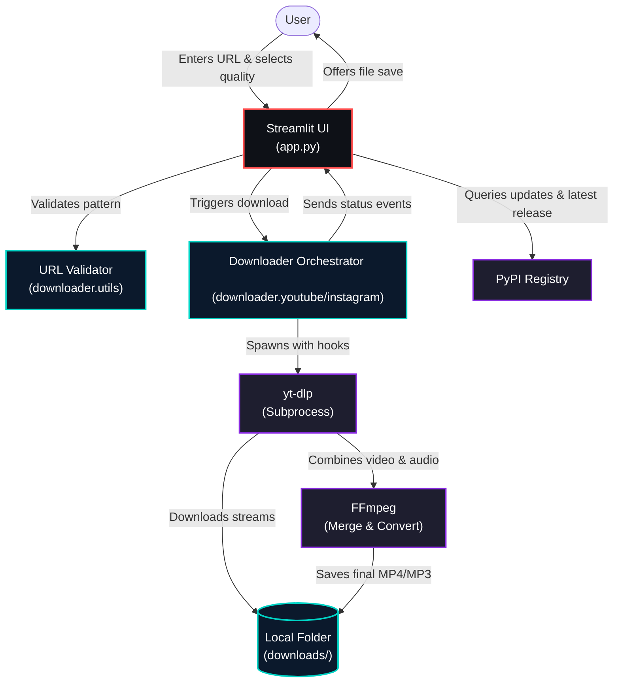

# ⬇️ Media Downloader

<p align="center">
  
</p>

> A sleek, production-quality **YouTube and Instagram media downloader** built with Streamlit and yt-dlp.
> Supports **macOS** (Apple Silicon & Intel), **Linux** (Ubuntu, Debian, Fedora, Arch), and **Windows 10/11**.

<p align="center">
  
  
  
  
  
  
  
</p>

---

## ✨ Features

| Feature | Details |
|---|---|
| 📹 **MP4 Video** | Downloads and merges the best available video + audio streams via `ffmpeg` |
| 🎵 **MP3 Audio** | Extracts high-quality audio streams at 192 kbps |
| 🎚️ **Quality Selector** | Choose between `best`, `1080p`, `720p`, `480p`, and `360p` resolutions |
| 🌐 **Multi-Platform Support** | Works with YouTube (Videos, Shorts, Music) and Instagram (Reels, Posts, IGTV, Stories) |
| ℹ️ **Rich Metadata** | Shows thumbnail, title, channel/author name, duration, and view count before downloading |
| ⚡ **Real-Time Progress** | Displays real-time download speeds, percentage progress, and ETA inside a status panel |
| 💾 **In-Browser Save** | Offers direct download to your local system without exposing internal server paths |
| 🎨 **Modern Dark UI** | Sleek Streamlit dark-theme panel, sidebar options, and collapsible logs |
| 🛡️ **Security Hardened** | XSS sanitisation on metadata, strict socket timeouts, and a 2 GiB file safety cap |
| ⚙️ **Automatic Updates** | Automatically checks for and updates `yt-dlp` to the latest PyPI version at every startup |

<br>

---

## 🚀 Quick Start

First, clone the repository and navigate to the project directory:

```bash
git clone https://github.com/kunalsuri/media-downloader.git
cd media-downloader
```

Then, run the launcher script designed for your operating system (see below :point_down:):

<br>

<details>
<summary><b>🚀 Click to Expand: Quick Start (OS Launchers & Manual Setup)</b></summary>

### 🪟 Windows (10 / 11)

There are two ways to run on Windows:

#### 1. One-Click Batch Launcher
* Open the `media-downloader` folder in Explorer.
* Double-click **`scripts\1Click-media-downloader.bat`**.
* A terminal window will open to initialize the environment and automatically launch the app in your default browser.
* On subsequent launches, this script will quickly verify dependencies and start in under 5 seconds.

#### 2. Advanced PowerShell Launcher
Open **PowerShell** and run:
```powershell
# Enable script execution for this session
Set-ExecutionPolicy -ExecutionPolicy RemoteSigned -Scope CurrentUser

# Run the setup and launch script
.\scripts\launch.ps1
```
* **System Setup**: If you are missing system dependencies like Python 3, Git, or `ffmpeg`, run `.\scripts\setup_windows.ps1` instead. It will detect your package manager (`winget`, `chocolatey`, or `scoop`) and install them automatically.

**Launcher Environment Variables (Optional):**
```cmd
:: Run CMD or set in Environment Variables:
set STREAMLIT_PORT=8888      :: Run app on port 8888
set RECREATE_VENV=1          :: Delete and rebuild the virtual environment from scratch
```

---

### 🍎 macOS (Apple Silicon & Intel)

Run the macOS launcher script:

```bash
chmod +x scripts/setup_macos.sh
./scripts/setup_macos.sh
```

**What it does automatically:**
* Detects processor architecture (Apple Silicon vs. Intel).
* Installs **Homebrew** and **ffmpeg** if they are missing (requires no sudo).
* Creates the virtual environment `.venv/`, upgrades pip, and installs all dependencies.
* Launches the application at **http://localhost:8501**.

**Environment Overrides:**
```bash
STREAMLIT_PORT=8888 ./scripts/setup_macos.sh
RECREATE_VENV=1 ./scripts/setup_macos.sh    # Forces clean rebuild of python env
SKIP_BREW=1 ./scripts/setup_macos.sh         # Skips Homebrew and dependency audits
```

---

### 🐧 Linux (Ubuntu, Debian, Fedora, Arch)

Run the Linux launcher script:

```bash
chmod +x scripts/setup_linux.sh
./scripts/setup_linux.sh
```

**What it does automatically:**
* Detects your Linux distribution and picks the correct package manager (`apt`, `dnf`, or `pacman`).
* Installs Python 3, pip, venv, Git, and `ffmpeg` if missing.
* Builds the virtual environment and starts the Streamlit app.

---

### 🔧 Manual Setup (Any OS)

If you prefer to configure your environment manually:

```bash
# Requirements: Python >= 3.10 and ffmpeg added to your system PATH

# 1. Create and activate a virtual environment
python -m venv .venv
source .venv/bin/activate          # macOS / Linux
# .venv\Scripts\Activate.ps1       # Windows PowerShell
# .venv\Scripts\activate.bat       # Windows CMD

# 2. Upgrade core pip modules & install dependencies
python -m pip install --upgrade pip wheel setuptools
python -m pip install -r requirements.txt

# 3. Start the application
streamlit run app.py
```

</details>

<br>

---

<br>

 
<details>
<summary><b>🗂️ Click to Expand: All Technical Detail</b></summary>

---

### 🗂️ Project Structure

```
media-downloader/
├── app.py                  # Streamlit frontend (sidebar, UI panels, downloads)
├── CLAUDE.md               # Developer guidelines & development workflow
├── requirements.txt        # Runtime python dependencies
├── requirements-dev.txt    # Testing & development dependencies
├── pytest.ini              # Pytest configuration
├── assets/                 # Repository visual assets (banners, logos)
├── downloader/             # Core downloader library
│   ├── __init__.py         # Shared module interface
│   ├── youtube.py          # YoutubeDownloader implementation
│   ├── instagram.py        # InstagramDownloader (inherits youtube)
│   ├── updater.py          # Version verification & yt-dlp auto-updates
│   └── utils.py            # Platform detection, filename sanitisation, formatting
├── scripts/                # Launchers, installers, and test tools
│   ├── 1Click-media-downloader.bat
│   ├── launch.ps1
│   ├── launch.sh
│   ├── setup_windows.ps1
│   ├── setup_macos.sh
│   ├── setup_linux.sh
│   ├── run_tests.bat
│   └── run_tests.sh
└── tests/                  # Pytest test suite (offline & integration tests)
```

---

### 🏗️ System Flow & Architecture

The diagram below shows the workflow of the application from user input to final file download:



---

### 🧪 Running Tests

A comprehensive unit test suite is available under the `tests/` directory to verify URL parsing, platform detection, file naming rules, and updater behaviors.

To run tests on your platform:

#### 🪟 Windows (Batch)
* Double-click **`scripts\run_tests.bat`** (runs offline tests).
* Run via terminal for arguments:
  ```cmd
  .\scripts\run_tests.bat --network   :: Includes PyPI + YouTube live connectivity tests
  .\scripts\run_tests.bat --cov       :: Runs tests and generates a test coverage report
  ```

#### 🍎/🐧 macOS & Linux (Shell)
* Run the test runner script:
  ```bash
  chmod +x scripts/run_tests.sh
  ./scripts/run_tests.sh
  ./scripts/run_tests.sh --network
  ./scripts/run_tests.sh --cov
  ```

</details>

<br>

---

## 🔒 Security & Safety Controls

* **Sandboxed Paths**: Media downloads are strictly written into `<project>/downloads/` using resolved, absolute paths to prevent directory traversal attacks.
* **Size Enforcement**: Downloader halts and errors if metadata reports files exceeding **2 GiB** to prevent disk storage exhaustion attacks.
* **XSS Defences**: All video metadata properties (titles, author descriptions, views) are HTML-escaped before display in Streamlit panels.
* **Execution Isolation**: All virtual environments are separate from the system path; updater scripts run package installations internally with `--quiet` flags.

---

## 📄 License

Distributed under the MIT License. See [LICENSE](LICENSE) for details.

© 2026 [Kunal Suri](https://github.com/kunalsuri)
